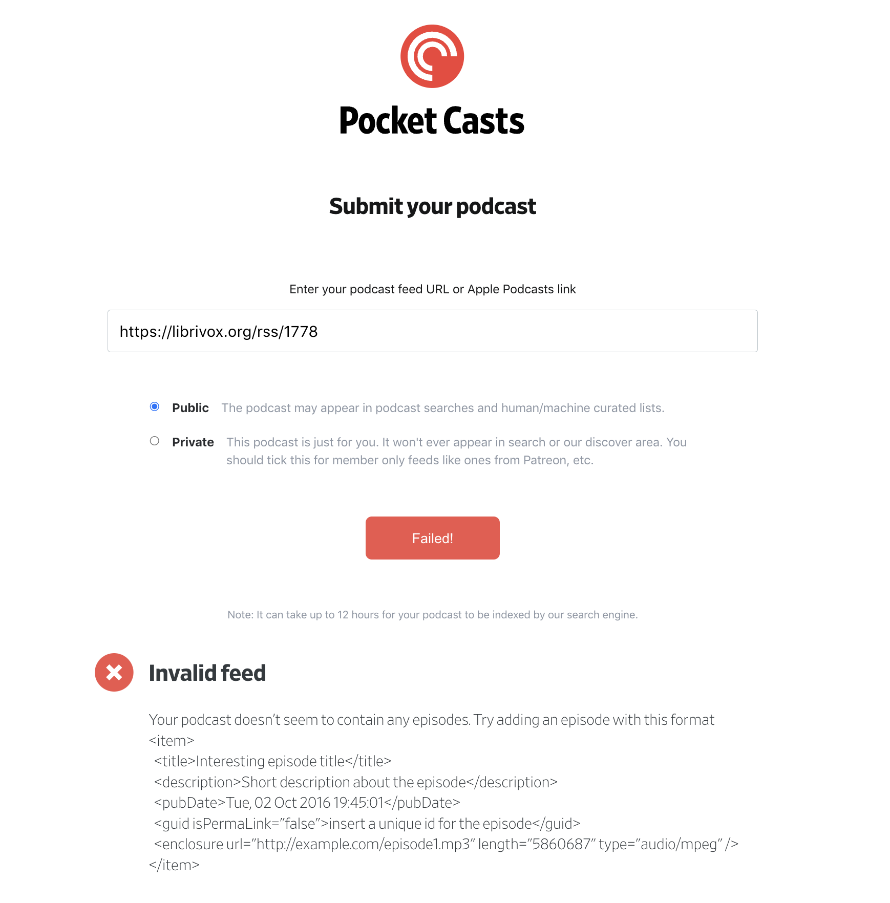
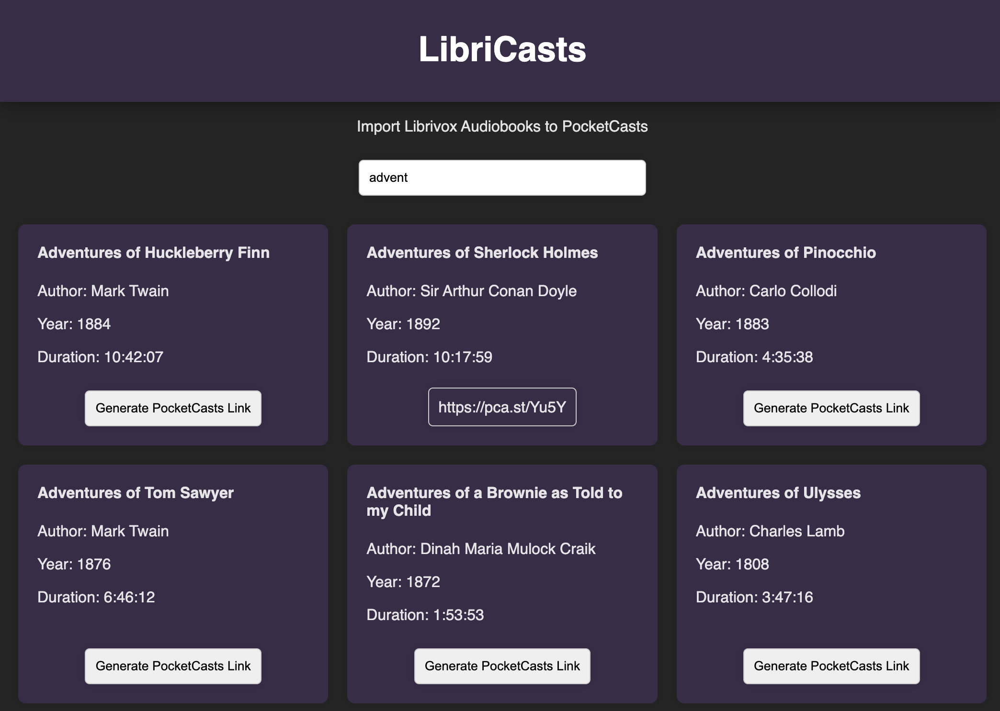

# Libricasts
Tool to automate fixing and uploading rss feeds from librivox.org to Pocketcasts
## Background
Have you tried importing your favourite public domain audiobooks into your favourite podcast app but it doesn't work? 

 The details are listed here in this great reddit [post](https://www.reddit.com/r/pocketcasts/comments/ekin6r/i_finally_found_ways_to_overcome_the_librivox/) but the gist is that the librivox rss file has the publish date commented out, but pocketcasts requires it to be there.

This tool automates the process of fixing the rss file, uploding it to Github Gist then generating the PocketCasts url.

## Usage
Go to https://libricasts.adhipk.dev/ and search for the title of the audiobook you want to import.

Select the audiobook and click generate pocketcasts link, this will generate a pocketcasts link for the audiobook.

## Installation and Setup

If you'd like to run this yourself, you can do so by following the steps below.

1. Clone the repo
    - `git clone https://github.com/adhipk/libricasts.git`
2. Install the requirements
    - `pip install -r requirements.txt`

3. Setup Redis store, this will cache Github gist urls, preventing redundant rss file uploads.
3. Copy the .env.example file to .env and fill in the values
### Running the app

1. From the root of the repo run `python server.py`

### Licence
MIT License